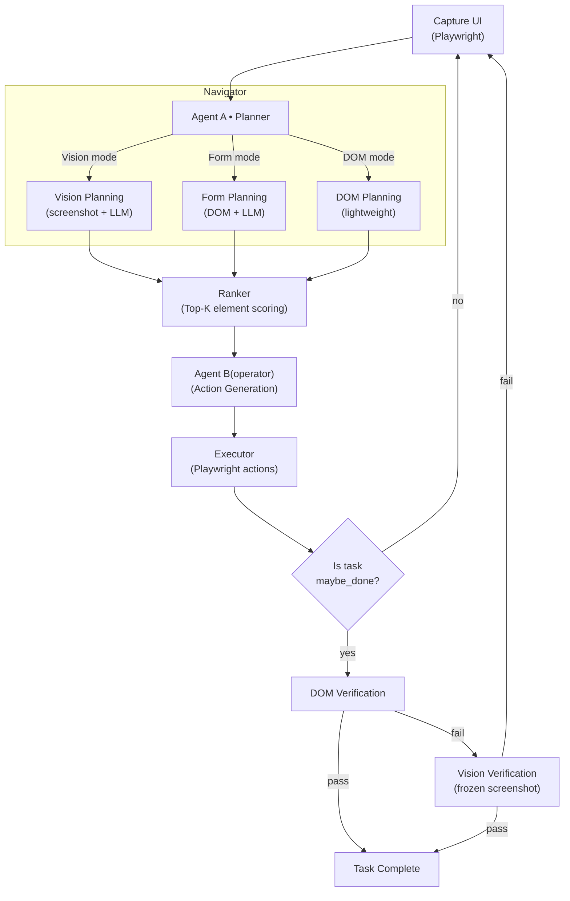

# Web Agent: Vision-Guided Browser Automation

## 1) Project Description
A two-agent system that automates browser workflows using Playwright plus vision/LLM planning. Agent A (Navigator) looks at a screenshot to decide the next high-level step; Agent B (Operator) turns that plan into DOM actions; an executor runs them safely in a live browser.

## 2) Architecture Diagram


## 3) Folder Structure
- `run_agent.py` — entry point.
- `web_agent/`
  - `agents/` — `navigator.py` (Agent A), `operator.py` (Agent B).
  - `core/` — config, orchestrator, graph, workflow, executor, history, types.
  - `dom/` — elements collector, scoring, ranker, accessibility helpers.
  - `utils/` — imaging (base64 + optional ID overlays).
- `artifacts/` — per-run outputs (screenshots, elements.json, actions, candidates).

## 4) How to Run (Setup & Commands)
Prereqs: Python 3.10+, Playwright browsers.  
1) Install deps:
```bash
pip install -r requirements.txt
python -m playwright install
```
2) Set env vars: `OPENAI_API_KEY` (and optional LangSmith tracing).  
3) Run:
```bash
python run_agent.py
```
By default it uses the hardcoded `USER_QUERY` in `run_agent.py`. Artifacts land in `artifacts/agent_a_demo/run_<id>/`.

## 5) How the Agent Loop Works
1) Capture: Playwright opens the target page (persistent session), takes a full-page screenshot, and collects visible clickable elements with roles/names/snippets → saves `elements.json` and `raw.png`.  
2) Agent A (Navigator): Vision+LLM sees the screenshot and user goal, returns an instruction plus optional `plan_steps` (e.g., a form macro with fields and submit flag).  
3) Ranker: Scores all elements and selects top candidates; for form-like instructions, it also appends likely inputs/selects even if they rank lower.  
4) Agent B (Operator): Consumes instruction/plan_steps + top candidates; outputs a small list of actions (`click/fill/select/press`) and a followup hint.  
5) Executor: Runs actions on the same live page, with guardrails (locator disambiguation, select-only-on-select roles, overlay dismissal, per-action retries). Captures `after_action.png`.  
6) Finalize/History: Records the step (instruction, actions, followup), maintains a rolling history, checks for `done`, and loops back to capture if more steps are needed (or stops if done/max steps).

## 5.1) Performance, Latency & Ops Notes

This agent is structured so that each step in the loop leaves behind enough information to debug and reason about behavior:

- **Artifacts per step**: screenshots, `elements.json`, action lists, and candidate rankings are written under `artifacts/` so you can reconstruct what the model saw and what it chose to do.
- **Separation of concerns**: navigation, element scoring, action generation, and execution are split across modules, which makes it straightforward to add logging or timing around specific stages.
- **Latency focus**: most overhead comes from model calls and screenshot capture; DOM parsing and ranking are comparatively fast and can be profiled independently.

### Latency & Cost per Request

A “request” here is a full task run (or a single step, depending on how you count it). The main contributors are:

- **Model latency**: vision+language calls for Agent A, and text-only calls for Agent B.
- **Browser latency**: page load, navigation, and screenshot capture via Playwright.
- **Local processing**: DOM extraction, ranking, and JSON serialization.

From LangSmith runs on real tasks, the early version of this agent (sending most inputs through full vision to Agent A on every step) showed:

- End-to-end task times often around **~90 seconds** for multi-step flows.

After tightening the loop by:
- Avoiding unnecessary vision calls (switching to DOM or form mode when possible), and  
- Skipping Agent A entirely on some followup steps when the DOM state was already well-understood,

the same flows settled into a **~45–60 second** range end-to-end, depending on page complexity and number of steps.

To keep this observable, a simple approach is to log at each boundary:

- Time per **planner** call (Agent A).
- Time per **operator** call (Agent B).
- Time per **executor** step (Playwright actions).

Cost per task is driven almost entirely by the number of model calls and the payload size (tokens and images). Logging per-step usage (tokens in/out, image calls) is usually enough to estimate cost per successful task and spot outliers in longer or more complex runs.

### Evaluation & Metrics

A few practical metrics that fit this project:

- **Task success rate**: fraction of tasks that reach “Task Complete” without manual intervention.
- **Average steps per task**: how many planner → operator → executor cycles are needed.
- **Latency per step / per task**: time from screenshot capture to actions executed, and total task time.
- **Error distribution**: counts of failures by type (e.g., selector missing, navigation timeout, model refusal).

These can be computed offline from the artifacts folder (by replaying runs and reading the JSON) or by streaming a small set of events to a metrics backend.

### Infrastructure & MLOps Principles

Even as a local script, the agent is laid out to work in more structured environments:

- **Containerization**: the code can be wrapped in a small image that runs Playwright + the agent loop, with `artifacts/` and `logs/` on a volume.
- **Remote execution**: the planner/operator calls can be fronted by an HTTP API or a task queue if the browser runs on a separate worker.
- **Logging and tracing**: the boundaries between planner, ranker, operator, and executor are natural places to add structured logs and traces.
- **Configuration via env**: model names, timeouts, and max steps can be moved into environment variables or config files for different environments.

These patterns are enough to support basic monitoring, debugging, and rollout without changing the loop described above.

### Example Postmortem: Agent Stuck in a Refresh Loop

**Symptom**  
On some pages, the agent repeatedly clicked a “refresh” or “reload” element, never progressing to the actual target button or form, and eventually hit its max steps.

**Investigation**

- The artifacts showed the same area of the page across multiple `raw.png` screenshots.
- `candidates_step_<n>.json` contained several high-scoring elements, but the top-ranked one was a refresh icon anchored in a fixed header.
- The executor logs confirmed the same click target being executed over multiple steps.

**Root Cause**

- The ranking heuristic favored elements that were always visible and visually prominent in the header.
- There was no explicit penalty for repeatedly selecting the same DOM node across steps.

**Fix**

- Added a simple “repeat element” penalty in the ranker: candidates that were already clicked in earlier steps for the same task lost score.
- Included a small feature in the candidate representation for “fixed header/footer” elements and slightly reduced their base score.
- Re-ran the failing scenario: the agent now clicked the refresh button once (when appropriate) and then moved on to the main call-to-action lower in the DOM.

This kind of postmortem is driven by the existing artifacts and does not require any additional tooling beyond what the agent already writes to disk.


## 6) How to Extend
- Swap models: change model names in `agents/navigator.py` or `agents/operator.py`.
- New domains: adjust `CLICKABLE_ROLES` or capture heuristics in `dom/elements.py`.
- Add actions: extend executor and teach Agent B the new action schema.
- Tracing: integrate LangSmith/OpenTelemetry in orchestrator.

## 7) Troubleshooting
- Select fails/missing option: check `actions_step_<n>.json` and `elements.json` to ensure the option exists; executor skips blind selects.  
- Click blocked by overlay: executor dismisses popovers/backdrops before critical clicks; verify dropdowns aren’t stuck open.  
- Wrong button chosen: inspect `candidates_step_<n>.json` to confirm in-form buttons are surfaced; tune scoring/capture if needed.  
- No actions: Agent B may have skipped invalid actions; inspect `actions_step_<n>.json`.

## 8) Contributing
- Fork/branch per feature.
- Keep changes modular; add/update tests if possible.
- Clear commit messages; run a quick smoke test (`python run_agent.py`).

## 9) License
MIT License (see `LICENSE`).
