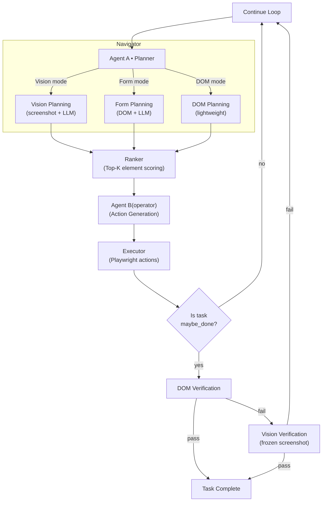

# Web Agent: Vision-Guided Browser Automation

## 1) Project Description
A two-agent system that automates browser workflows using Playwright plus vision/LLM planning. Agent A (Navigator) looks at a screenshot to decide the next high-level step; Agent B (Operator) turns that plan into DOM actions; an executor runs them safely in a live browser.

## 2) Architecture Diagram


## 3) Folder Structure
- `run_agent.py` — entry point.
- `web_agent/`
  - `agents/` — `navigator.py` (Agent A), `operator.py` (Agent B).
  - `core/` — config, orchestrator, graph, workflow, executor, history, types.
  - `dom/` — elements collector, scoring, ranker, accessibility helpers.
  - `utils/` — imaging (base64 + optional ID overlays).
- `artifacts/` — per-run outputs (screenshots, elements.json, actions, candidates).

## 4) How to Run (Setup & Commands)
Prereqs: Python 3.10+, Playwright browsers.  
1) Install deps:
```bash
pip install -r requirements.txt
python -m playwright install
```
2) Set env vars: `OPENAI_API_KEY` (and optional LangSmith tracing).  
3) Run:
```bash
python run_agent.py
```
By default it uses the hardcoded `USER_QUERY` in `run_agent.py`. Artifacts land in `artifacts/agent_a_demo/run_<id>/`.

## 5) How the Agent Loop Works
1) Capture: Playwright opens the target page (persistent session), takes a full-page screenshot, and collects visible clickable elements with roles/names/snippets → saves `elements.json` and `raw.png`.  
2) Agent A (Navigator): Vision+LLM sees the screenshot and user goal, returns an instruction plus optional `plan_steps` (e.g., a form macro with fields and submit flag).  
3) Ranker: Scores all elements and selects top candidates; for form-like instructions, it also appends likely inputs/selects even if they rank lower.  
4) Agent B (Operator): Consumes instruction/plan_steps + top candidates; outputs a small list of actions (`click/fill/select/press`) and a followup hint.  
5) Executor: Runs actions on the same live page, with guardrails (locator disambiguation, select-only-on-select roles, overlay dismissal, per-action retries). Captures `after_action.png`.  
6) Finalize/History: Records the step (instruction, actions, followup), maintains a rolling history, checks for `done`, and loops back to capture if more steps are needed (or stops if done/max steps).

## 6) How to Extend
- Swap models: change model names in `agents/navigator.py` or `agents/operator.py`.
- New domains: adjust `CLICKABLE_ROLES` or capture heuristics in `dom/elements.py`.
- Add actions: extend executor and teach Agent B the new action schema.
- Tracing: integrate LangSmith/OpenTelemetry in orchestrator.

## 7) Troubleshooting
- Select fails/missing option: check `actions_step_<n>.json` and `elements.json` to ensure the option exists; executor skips blind selects.  
- Click blocked by overlay: executor dismisses popovers/backdrops before critical clicks; verify dropdowns aren’t stuck open.  
- Wrong button chosen: inspect `candidates_step_<n>.json` to confirm in-form buttons are surfaced; tune scoring/capture if needed.  
- No actions: Agent B may have skipped invalid actions; inspect `actions_step_<n>.json`.

## 8) Contributing
- Fork/branch per feature.
- Keep changes modular; add/update tests if possible.
- Clear commit messages; run a quick smoke test (`python run_agent.py`).

## 9) License
MIT License (see `LICENSE`).
